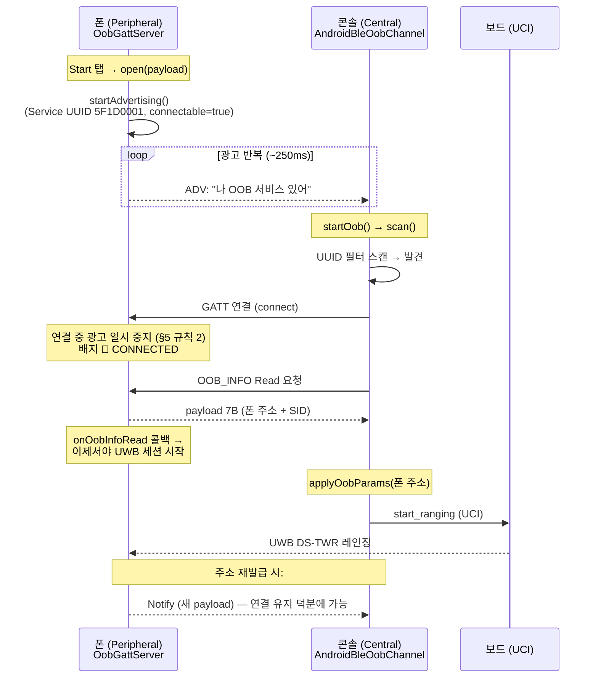
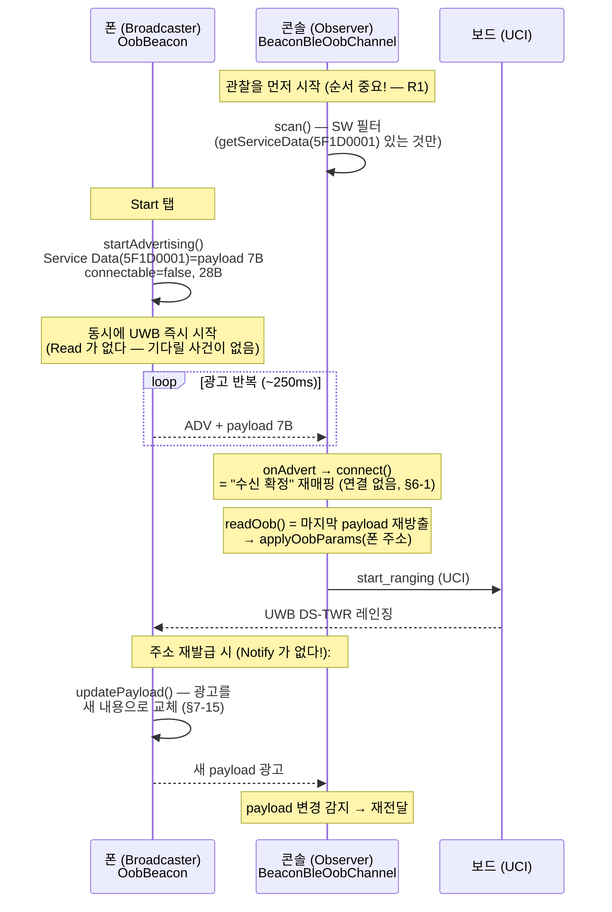
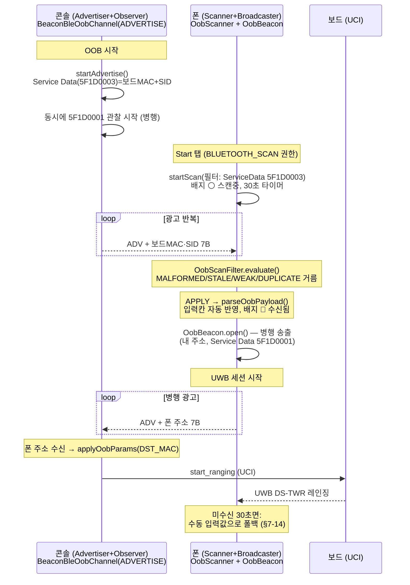
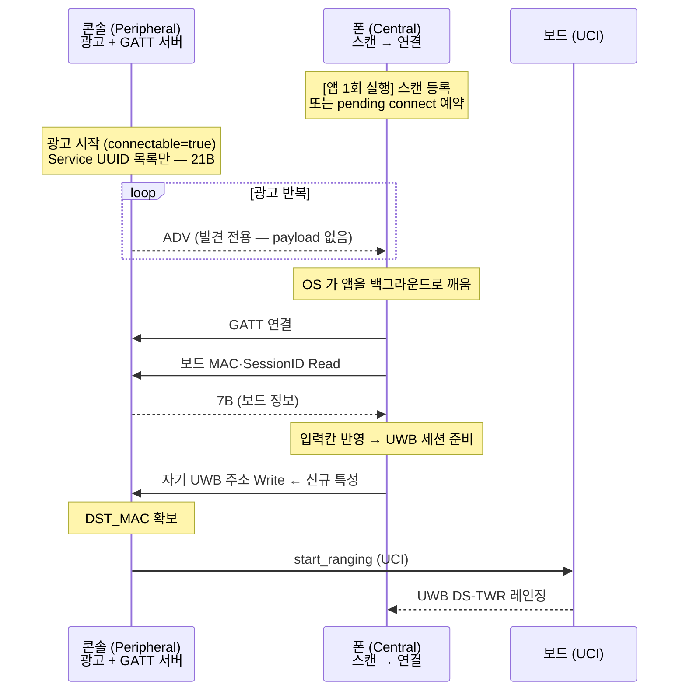

# BLE OOB 3모드 개발 가이드 (입문용)

> 작성 2026-08-12. BLE 를 처음 접하는 개발자가 이 프로젝트의 OOB 3모드
> (사양서 v0.4, spec 001)를 소스와 함께 이해할 수 있게 쓴 학습 문서.
> 계약의 진실원천은 `docs/oob/BLE_OOB_인터페이스_사양서.md` — 이 문서는 **설명서**다.
> 소스 참조: 폰 = 이 리포, 콘솔 = `uwb-console-kotlin` (경로는 각 절에 표기).

**읽는 순서**

| 절 | 내용 | 이럴 때 |
|---|---|---|
| §1 | BLE 기초 (광고/GATT/31B 예산/OOB payload) | BLE 가 처음이면 여기부터 |
| §2~§4 | 모드 1·2·3 — 시퀀스 다이어그램 + 제약 | 구현·검수 중 흐름을 확인할 때 |
| §5 | 백그라운드·콜드 웨이크 (Android/iOS) | "앱이 꺼져 있어도 되나?" |
| §6 | iOS 지원 정리 | 크로스 플랫폼을 검토할 때 |
| §7 | **모드 4** (방향 채택 — 사양서 v0.5 개정 대기) | iOS·백그라운드까지 보려 할 때 |
| §8~§10 | FAQ · 제약 치트시트 · 용어집 | 막혔을 때 먼저 여기 |

> 검수 절차·함수 추적은 같은 폴더의 `검수10-13_함수_호출_맵.md` 를 함께 본다.

---

## 1. BLE 기초 — 이것만 알면 3모드가 읽힌다

### 1-1. 두 가지 세계: 광고(연결 없음)와 GATT(연결 있음)

BLE 통신은 크게 두 층으로 나뉜다:

| 층 | 무엇 | 비유 |
|---|---|---|
| **Advertising (광고)** | 작은 패킷을 일방적으로 반복 방송. 연결 없음 | 가게 앞에서 전단지 뿌리기 |
| **GATT (연결)** | 1:1 연결 후 데이터를 읽기/쓰기/구독 | 가게에 들어가 점원과 대화 |

### 1-2. 역할 이름 (GAP roles)

| 역할 | 하는 일 | Android API | 이 프로젝트에서 |
|---|---|---|---|
| **Advertiser / Broadcaster** | 광고 송출 | `BluetoothLeAdvertiser.startAdvertising()` | 폰 모드 1·2, 콘솔 ADVERTISE |
| **Scanner / Observer** | 광고 수신(관찰) | `BluetoothLeScanner.startScan()` | 폰 모드 3, 콘솔 SCANNER·BEACON |
| **Peripheral** | 광고 + 연결 받는 쪽 (GATT 서버) | `BluetoothGattServer` | 폰 모드 1 |
| **Central** | 스캔 + 연결 거는 쪽 (GATT 클라이언트) | `BluetoothGatt` (connectGatt) | 콘솔 SCANNER(v1) |

**핵심**: "Beacon" 은 별도 기술이 아니라 **연결을 받지 않는(connectable=false) Advertiser** 를
부르는 관용어다. iBeacon(Apple)·Eddystone(Google)은 그 위에 정의된 payload 포맷일 뿐이다.
이 프로젝트의 BEACON 모드도 표준 광고 + Service Data 포맷이다.

### 1-3. 광고 패킷의 구조 — 31바이트의 세계

레거시 BLE 광고 패킷의 payload 는 **최대 31B**. 내용은 AD(Advertising Data) 구조체의 나열이다:

```
[길이 1B][타입 1B][데이터 …]  가 반복
```

이 프로젝트가 쓰는 AD 타입:

| AD 타입 | 이름 | 용도 |
|---|---|---|
| `0x01` | Flags | 필수 3B (발견 가능 모드 표시) |
| `0x07` | Complete List of 128-bit Service UUIDs | "나 이 서비스 있어" (모드 1 광고) |
| `0x21` | **Service Data - 128-bit UUID** | UUID + 임의 데이터 동봉 (모드 2·3 광고) |
| `0x09` | Complete Local Name | 기기 이름 — 본 광고엔 안 넣고 **스캔 응답**에 |

**이 프로젝트의 모드 2·3 광고 예산 계산** (사양서 §5-1):

```
Flags(3B) + ServiceData128 [len 1 + type 1 + UUID 16 + payload 7] (25B) = 28B ≤ 31B
```

여유가 사실상 0 이다. 그래서:
- Service UUID 목록(0x07, 18B)은 **함께 못 넣는다** → 스캔 필터는 Service Data 로 잡아야 함
- 페이로드에 1B 라도 추가하려면 사양서 개정이 선행돼야 한다 (P5)
- 기기 이름은 **스캔 응답**(scanner 가 추가로 요청하는 두 번째 31B)에 넣는다

> BT5 의 Extended Advertising 은 255B 까지 가능하지만 수신측 호환성 문제로 이 프로젝트는
> 레거시 31B 만 쓴다.

### 1-4. GATT 용어 30초 정리 (모드 1 이해용)

- **Service**: 기능 묶음. UUID 로 식별 (이 프로젝트: `5F1D0001-…`)
- **Characteristic**: 서비스 안의 데이터 항목 (이 프로젝트: OOB_INFO `5F1D0002-…`, Read+Notify)
- **Read**: central 이 값을 당겨감 / **Notify**: peripheral 이 값 변경을 밀어줌
- **CCCD** (`0x2902` descriptor): central 이 "Notify 보내줘" 라고 구독 신청하는 스위치

### 1-5. 이 프로젝트가 BLE 를 쓰는 이유 (OOB)

UWB 레인징을 시작하려면 보드(controller)가 **폰의 UWB 주소(DST_MAC)** 를 알아야 하는데,
이 주소는 **세션마다 재발급**된다. 매번 사람이 옮겨 적는 대신 BLE 로 자동 교환한다 —
UWB 바깥(Out-Of-Band)에서 이루어지는 교환이라 **OOB** 라고 부른다.

교환하는 데이터는 단 7B (사양서 §4, `UwbDefaults.buildOobPayload`/`parseOobPayload`):

```
offset 0    1B   protocol_version (0x01)
offset 1-2  2B   uwb_address   — 표시 순서 그대로, 반전 금지
offset 3-6  4B   session_id    — uint32 little-endian (42 → 2A 00 00 00)
```

⚠ 바이트 순서가 이 도메인 최대 함정이다. 주소는 반전 없음, session_id 는 LE.
틀려도 에러가 안 나고 **조용히 아무것도 안 된다.**

---

## 2. 모드 1 — ADVERTISE-GATT (폰 peripheral ↔ 콘솔 central)

**v1 부터 검증된 기본 경로. 회귀 기준.** GATT 연결이 있어 양방향(Read + Notify)이 된다.

- 폰 소스: `uwb/OobGattServer.kt` (광고 + GATT 서버)
- 콘솔 소스: `ble/AndroidBleOobChannel.kt` (스캔 + GATT central)



**특징·제약**
- 폰은 **Read 를 받은 직후에** UWB 를 시작한다 (`waitForOobRead`, 30초 타임아웃) —
  스캔·연결에 걸리는 시간 동안 폰 UWB 세션의 10초 자동종료가 먼저 오는 것을 막기 위한 순서.
- 연결이 있으므로 **Notify** 로 주소 재발급을 즉시 전달할 수 있다 (모드 2·3에는 없는 장점).
- 대신 지연이 크다: 스캔 → 연결 → 서비스 발견 → Read = 수백 ms ~ 수 초.
- 연결은 1:1 — 콘솔 여러 대가 동시에 붙는 시나리오에 부적합.

---

## 3. 모드 2 — BEACON (폰 송출 ↔ 콘솔 관찰)

**커넥션리스.** 폰이 OOB_INFO 7B 를 광고 패킷의 Service Data 에 실어 방송하고,
콘솔은 관찰만 한다. 연결·Read 가 없어서 **광고 수신 = 즉시 파라미터 확보**.

- 폰 소스: `uwb/OobBeacon.kt`
- 콘솔 소스: `ble/BeaconBleOobChannel.kt` (mode=BEACON)



**특징·제약**
- **응답 채널이 없다** — 폰은 콘솔이 광고를 봤는지 모른다. 그래서 UWB 를 즉시 시작하는데,
  콘솔이 늦으면 폰 세션이 10초 자동종료될 수 있다 (R1). 광고는 유지되므로(P7) 재Start 로 복구.
- Notify 의 대응물 = **광고 내용 교체** (`OobBeacon.applyPayloadLocked` — stop→start).
  콘솔은 같은 기기의 payload 가 바뀐 것을 감지해 재반영한다 (`changedForSelected`).
- 브로드캐스트라 **콘솔 여러 대가 동시에 수신 가능** (모드 1과 다른 점).
- 평문 방송이다 — 주소·SID 가 주변 모든 스캐너에 노출된다 (브링업 도구라 허용, 사양서 Out-of-Scope).
- 콘솔이 HW 필터(`ScanFilter.setServiceData`) 대신 SW 필터를 쓰는 이유: HW 필터는 데이터
  **값까지** 매칭해서, 주소 재발급으로 payload 가 바뀌는 이 설계와 맞지 않는다.

---

## 4. 모드 3 — SCANNER (콘솔 송출 ↔ 폰 관찰 + 병행 송출)

방향이 뒤집힌다: **콘솔이** 보드 MAC·Session ID 를 광고하고(`5F1D0003`), 폰이 수신해
입력칸을 자동으로 채운다. 그런데 보드는 여전히 폰 주소가 필요하므로, 폰은 수신 직후
**자신의 OOB_INFO 를 모드 2 방식으로 병행 송출**한다 (§2-1, 2026-08-12 확정).

- 폰 소스: `uwb/OobScanner.kt`(관찰) + `uwb/OobScanFilter.kt`(수신 판정) +
  `uwb/OobBeacon.kt`(병행 송출) + `MainViewModel.onOobAdvertReceived()`(조정)
- 콘솔 소스: `ble/BeaconBleOobChannel.kt` (mode=ADVERTISE — 송출+관찰 병행)



### 4-1. 모드 3 의 제약사항 (자세히)

**① 스캔 권한 (Android 12+)**
- 광고 송출(`BLUETOOTH_ADVERTISE`)과 달리 **스캔은 `BLUETOOTH_SCAN` 권한이 별도로 필요**하다.
- 스캔은 위치 추적에 악용될 수 있어서(비콘 지도) Android 는 위치 권한과 엮는데,
  `android:usesPermissionFlags="neverForLocation"` 을 선언하면 위치 권한 없이 스캔할 수 있다
  — 대신 시스템이 iBeacon 류 일부 광고를 필터링할 수 있다 (이 프로젝트 payload 는 무관).
- 이 앱은 **모드 3 선택 시에만** SCAN 을 요청한다 (`bleOobPermissionsFor(mode)` — 불필요 권한 금지, D5).

**② 스캔 캐시 함정 (사양서 §7-12)**
- Android 스택은 스캔 결과를 캐시·병합해 보고한다 — **죽은 광고**(이미 꺼진 콘솔의 옛 광고)가
  섞여 올 수 있다. 그래서 `OobScanFilter` 가 순수 함수로 거른다:
  - `STALE`: `ScanResult.timestampNanos` 기준 5초보다 오래된 것
  - `WEAK`: rssi < −95dBm (잔존 캐시 의심 — 일부러 관대한 하한)
  - `DUPLICATE`: 직전 반영 payload 와 동일 (입력칸 깜빡임 방지)
  - `MALFORMED`: 7B 미만 (§7-13)

**③ 스캔 필터의 함정**
- 모드 2·3 광고에는 Service UUID 목록 AD 가 없다 (31B 예산) — 그래서
  `ScanFilter.setServiceUuid()` 로는 **안 잡힌다.** Service Data 존재로 잡아야 한다.
- 폰은 `setServiceData(uuid, ByteArray(0))` (빈 값 = 존재 매치), 콘솔은 필터 없이 스캔 후
  SW 판별 — 방식은 달라도 이유는 같다.

**④ 스캔 빈도 제한 (Android 숨은 제약)**
- 앱이 30초 안에 스캔을 5회 이상 start/stop 하면 시스템이 차단한다
  (`SCAN_FAILED_SCANNING_TOO_FREQUENTLY`). Start/Stop 을 빠르게 반복하는 테스트에서 만날 수 있다
  — 잠깐(30초) 기다리면 풀린다.
- 화면이 꺼지면 필터 없는 스캔은 결과가 오지 않을 수 있다 (배터리 보호) — 이 앱은 필터가
  있어 해당 없음, 다만 Galaxy 절전("잠자는 앱")은 별도로 스캔을 죽일 수 있다.

**⑤ 송출+관찰 동시 동작 (병행안 리스크, plan R2)**
- 모드 3 의 폰과 콘솔 ADVERTISE 는 **advertiser 와 scanner 를 동시에** 돌린다.
  대부분의 최신 칩셋은 문제없지만 일부 저가 칩셋은 제약이 있다.
  실패해도 설계상 종결된다: 송출 실패 = 상대가 수동 입력 폴백, 관찰은 계속 (P6/P8).

**⑥ 백그라운드**
- 현재 spec 001 은 **포그라운드(+FGS) 전제**다. 앱 미실행 상태에서 광고로 깨어나는
  콜드 웨이크는 `specs/002-cold-wake` 로 분리돼 있다 (PendingIntent 스캔 —
  프로세스가 죽어도 OS 가 스캔을 유지하고 매치 시 broadcast 로 깨움).

---

## 5. 백그라운드·콜드 웨이크 — "앱이 꺼져 있어도 되나?"

지금까지의 3모드는 전부 **사용자가 Start 를 누른 뒤 포그라운드(+FGS)** 를 전제로 한다.
"앱을 실행하지 않아도 콘솔 비콘을 받으면 알아서 레인징을 시작" 하는 시나리오는
`specs/002-cold-wake` 로 분리돼 있고 **아직 구현 전**이다. 이 절은 그 전제 지식이다.

### 5-1. Android — PendingIntent 스캔

```kotlin
// API 26+. 프로세스가 죽어도 OS 가 스캔을 유지하고, 매치 시 broadcast 로 앱을 깨운다
scanner.startScan(filters, settings, pendingIntent)
```

스캔 결과는 인텐트 extra(`EXTRA_LIST_SCAN_RESULT`, `EXTRA_CALLBACK_TYPE`)로 들어온다.
**흔한 오해 3가지를 짚어둔다:**

| 오해 | 실제 |
|---|---|
| "OS 가 **앱을 실행**해 준다" | 깨어나는 건 **BroadcastReceiver** 다. Activity·UI 는 뜨지 않고, `onReceive()` 에서 약 10초 안에 끝내야 한다. 매니페스트에 명시 등록 필요(암시적 브로드캐스트 제한) |
| "설치만 해두면 된다" | 등록은 **앱이 살아 있을 때 최소 1회** 해야 한다 (사용자가 앱을 열고 토글 ON). **재부팅하면 소멸** — `BOOT_COMPLETED` 재등록은 spec 002 범위 밖 |
| "깨어나면 끝" | **진짜 관문은 깨어난 다음이다.** UWB 는 포그라운드 앱이나 FGS 에서만 허용돼, FGS 없이 세션을 열면 무증상으로 죽는다 |

세 번째가 spec 002 의 성립 조건이다. Android 12+ 는 백그라운드 FGS 시작을 막지만
**예외 목록에 "BLUETOOTH_SCAN/CONNECT 권한이 필요한 블루투스 브로드캐스트 수신"이 있다.**
PendingIntent 스캔 결과가 그 예외에 해당하는지는 아직 확인되지 않았다 —
이것이 spec 002 의 **T101 스파이크**(최우선 검증 항목)다. 불허로 판명되면
"앱에서 한 번 켜두면 상시 FGS 유지"(대기/Arm 방식)로 후퇴한다.

추가 함정: Galaxy 의 **"잠자는 앱"** 절전 정책이 등록된 스캔·리시버를 통째로 죽일 수 있고
(배터리 최적화 제외 권장), Doze 에서는 결과 전달이 지연·배치될 수 있다.

### 5-2. iOS — State Preservation & Restoration

iOS 의 대응물은 **상태 복원**이다. `CBCentralManager` 생성 시
`CBCentralManagerOptionRestoreIdentifierKey` 를 주고 Info.plist 에 `bluetooth-central`
백그라운드 모드를 선언하면, 앱이 종료돼도 매치 시 iOS 가 앱을 **백그라운드로 되살리고**
`centralManager(_:willRestoreState:)` 를 호출한다. 개념은 같지만 조건이 다르다:

| | Android (PendingIntent) | iOS (Restoration) |
|---|---|---|
| 사용자가 앱을 **강제 종료**(스와이프) | 계속 살아남아 다시 깨어남 | **다시는 안 깨어남** — "의도적 중단"으로 간주 |
| 재부팅 후 | 재등록 필요 | 사용자가 앱을 **한 번 직접 실행**해야 복원 활성화 |
| 백그라운드 스캔 필터 | 자유 (Service Data 필터 가능) | **Service UUID 지정 필수** — `withServices: nil` 금지 |

### 5-3. ⚠ iOS 는 현재 광고 포맷으로 콜드 웨이크가 불가능하다

세 번째 줄이 우리에게 치명적이다. §1-3 에서 봤듯 **모드 2·3 광고에는 31B 예산 때문에
Service UUID 목록 AD(0x07)가 없다.** UUID 는 Service Data AD **안에만** 존재한다.

- **Android**: `ScanFilter.setServiceData(uuid, …)` 로 Service Data 안의 UUID 를 직접 필터 → OK
- **iOS**: `scanForPeripherals(withServices:)` 는 **광고된 Service UUID 목록** 기준으로 매치한다.
  포그라운드라면 `nil` 스캔 후 `CBAdvertisementDataServiceDataKey` 를 직접 확인하면 되지만,
  **백그라운드에서는 nil 스캔이 금지** → **매치할 방법이 없다**

즉 iOS 콜드 웨이크는 API 문제 이전에 **패킷 포맷 문제**로 막힌다. 코드로 우회할 수 없다.

**대안 1 — 16비트 UUID 로 교체** (사양서 개정 필요):

```
Flags                        3B
Service Data 16-bit (0x16)  11B  (len 1 + type 1 + UUID 2 + payload 7)
16-bit UUID 목록 (0x03)       4B  (len 1 + type 1 + UUID 2)
────────────────────────────────
                            18B ≤ 31B  ✅ (여유 13B)
```

들어가긴 하지만 **권장하지 않는다**: 16비트 UUID 는 Bluetooth SIG 할당이 원칙이라
임의값은 타 제품과 충돌 위험이 있고, 사양서 개정 + 양 리포 동시 커밋 + pin bump 가
따라온다 (P5/P13). **대안 2 는 §7 (모드 4) 이며, 그쪽이 더 근본적이다.**

---

## 6. iOS 폰이라면? (참고 — 이 프로젝트는 Android 전용)

controlee 앱을 iOS 로 포팅한다고 가정할 때 CoreBluetooth 의 차이가 3모드의 성립 가능성을
바꾼다. **결론 먼저: 모드 1 은 (포그라운드에서) 되고, 모드 2 는 불가능하고, 모드 3 은 반쪽만 된다.**

| | Android (현재) | iOS (CoreBluetooth) |
|---|---|---|
| GATT peripheral (모드 1) | `BluetoothGattServer` | ✅ `CBPeripheralManager` — 동등하게 가능 |
| **Service Data 광고 송출** (모드 2, 모드 3 병행 송출) | `AdvertiseData.addServiceData()` | ❌ **불가능.** iOS 앱은 광고에 `LocalName` 과 `Service UUID 목록`만 넣을 수 있다 — Service Data·Manufacturer Data 송출 API 자체가 없다 |
| Service Data **수신** (모드 3 관찰) | `ScanRecord.getServiceData()` | ✅ 가능 (`CBAdvertisementDataServiceDataKey`) |
| 스캔 필터 | ServiceData/ServiceUuid 필터 | △ `scanForPeripherals(withServices:)` 는 광고의 **Service UUID 목록** 기준 — Service Data 의 UUID 까지 매칭된다는 보장이 없어, 필터 nil 스캔이 필요할 수 있다 |
| 백그라운드 광고 | FGS 로 유지 | △ 백그라운드에선 Service UUID 가 "overflow 영역"으로 밀려 iOS 기기끼리만 발견 가능, Local Name 제거 |
| 백그라운드 스캔 | FGS / PendingIntent(002) | △ `bluetooth-central` background mode 필요 + **필터 nil 스캔 금지**(UUID 명시 필수) + 중복 이벤트 병합 |
| 스캔/광고 권한 | BLUETOOTH_SCAN/ADVERTISE 런타임 | 앱 단위 Bluetooth 권한 1개 (`NSBluetoothAlwaysUsageDescription`) |

**의미를 풀어 쓰면:**

1. **모드 2 (폰 BEACON) 는 iOS 에서 성립 불가** — payload 를 광고에 실을 방법이 없다.
   iOS 폰이 자기 주소를 커넥션리스로 알리려면 사양서 자체를 바꿔야 한다
   (예: iOS 는 Service UUID 광고만 하고 콘솔이 연결해서 Read — 사실상 모드 1로 회귀).
2. **모드 3 도 반쪽** — 콘솔 광고 **수신**(보드 MAC·SID 자동 반영)은 되지만,
   §2-1 **병행 송출이 불가능**해서 콘솔이 폰 주소를 얻을 길이 없다 → 폰 주소는 수동 입력
   (사양서 §7-14 폴백이 상시 경로가 됨).
3. **모드 1 이 iOS 호환 경로다 — 단, 포그라운드 한정.** GATT peripheral + Read/Notify 는
   CoreBluetooth 로 그대로 구현된다. 크로스 플랫폼을 고려한다면 모드 1을 기본으로 유지하는
   현재 설계가 옳다.
4. **그러나 모드 1 은 iOS 백그라운드에서 깨진다** — iOS 앱이 백그라운드로 광고하면
   Local Name 이 제거되고 Service UUID 가 **overflow 영역**으로 밀려
   **iOS 기기끼리만** 발견 가능해진다. 즉 Android 콘솔은 백그라운드 아이폰을 **못 찾는다.**
   → **iOS 백그라운드 시나리오에서는 폰이 반드시 central(스캔·연결하는 쪽)이어야 한다.**
   이 결론이 §7 (모드 4 제안) 의 출발점이다.
5. 참고: Apple 생태계의 "비콘" = iBeacon 은 Manufacturer Data 기반의 별도 포맷이고,
   iOS 앱조차 포그라운드에서만 iBeacon 을 송출할 수 있다. 이 프로젝트의 BEACON 과는
   포맷·용도가 다르다.

| 시나리오 | Android | iOS |
|---|---|---|
| 모드 1 (GATT) 자동 교환 | ✅ | ✅ 포그라운드에서 완전 동작 |
| 모드 3 수신 (포그라운드) | ✅ | ✅ nil 스캔 + Service Data 확인 |
| 모드 3 **콜드 웨이크** | △ 성립 가능성 (T101 스파이크) | ❌ 현 포맷으론 불가 (§5-3) |
| 폰 주소 자동 **송출** (모드 2·3 병행) | ✅ | ❌ 구조적으로 불가 |

> 크로스 플랫폼 판단의 결론·근거·대안은 **§8 FAQ Q1~Q12** 에 정리돼 있다.

---

## 7. 모드 4 — GATT 역방향 (✅ 방향 채택 2026-08-12 · 사양서 개정 대기)

> **G0 확정 (2026-08-12 사용자): Android+iOS 모두 지원, 충돌 시 iOS 기준.** 이에 따라
> 이 구조가 spec 002(콜드 웨이크)의 교환 방식으로 **채택**됐다. 단 **아직 계약은 아니다** —
> 사양서 v0.5 개정(마스터: 콘솔 리포)이 확정돼야 구현에 들어간다
> (`docs/handoff/HANDOFF_모드4_사양서개정_요청.md`, spec 002 T001). 이 절의 UUID·특성
> 배치는 제안값이며 확정 시 갱신한다.

§5-3 과 §6-4 의 두 벽 — "iOS 는 payload 를 광고에 못 싣는다" 와 "iOS 백그라운드는
UUID 목록으로만 필터한다" — 을 **동시에** 푸는 구조다. 발상은 간단하다:

> **광고는 "발견" 전용으로 비우고, 데이터는 GATT 연결로 옮긴다.**
> 그리고 폰을 peripheral 이 아니라 **central** 로 세운다.

| | 모드 1 (현행) | **모드 4 (제안)** |
|---|---|---|
| 콘솔 | central (스캔·연결) | **peripheral** (광고 + GATT 서버) |
| 폰 | peripheral (광고 + GATT 서버) | **central** (스캔·연결) |
| 보드 MAC·SID 전달 | (폰이 몰라도 됨 — 수동 입력) | 콘솔 특성 **Read** |
| 폰 주소 전달 | 폰 특성 Read/Notify | 폰이 콘솔에 **Write** ← 신규 |
| iOS 백그라운드 | ❌ overflow 문제 | ✅ 폰이 central 이라 가능 |

### 7-1. 시퀀스



### 7-2. 광고 예산 — 오히려 여유가 생긴다

payload 를 GATT 로 옮기므로 광고에는 UUID 목록만 실으면 된다:

```
Flags                          3B
128비트 Service UUID 목록      18B   (len 1 + type 1 + UUID 16)
──────────────────────────────────
                              21B ≤ 31B  ✅ (여유 10B)
```

**16비트 UUID 발급이 불필요**하다 (§5-3 대안 1 의 SIG 할당 문제를 우회). 그리고 이 광고는
Service UUID 목록을 갖고 있으므로 **iOS 가 백그라운드에서 필터링할 수 있다.**

### 7-3. iOS 의 pending connect — 스캔보다 나은 경로

iOS 에는 스캔보다 강력한 기능이 있다. `centralManager.connect(peripheral:)` 를 걸어두면
**그 연결 요청이 앱 종료 후에도 큐에 무기한 남아 있다가**, 해당 peripheral 이 나타나는
순간 iOS 가 앱을 깨우고 연결시킨다. 상시 스캔보다 전력 효율도 좋다.

### 7-4. 채택하려면 바꿔야 할 것 (계약 변경)

1. **Write 특성 신설** — 현재 OOB_INFO 는 `Read + Notify (Write 없음)` 으로 고정돼 있다 (사양서 §3)
2. **콘솔에 GATT 서버 역할 신설** — 콘솔은 현재 central 만 구현돼 있다 (`AndroidBleOobChannel`)
3. **콘솔 광고를 `connectable=true` 로** — 현재 ADVERTISE 모드는 `false`
4. 사양서 버전 업 + **양 리포 동시 커밋 + 콘솔 pin bump** (P5/P13). 콘솔 쪽은 별도 세션 작업

Android 폰도 이 모드를 그대로 쓸 수 있으므로 **플랫폼 통합 경로**가 된다 —
`specs/002-cold-wake` 가 이 구조로 **전면 개정됐다** (2026-08-12 G0 확정, Q12 참조).

### 7-5. 그래도 남는 제약

BLE 쪽은 대부분 풀리지만 이건 남는다:

1. **사용자 강제 종료 시 iOS 는 복원하지 않는다** (§5-2) — 구조적 정책이라 우회 불가
2. **재부팅 후 수동 실행 1회 필요**
3. **백그라운드 발견 지연** — iOS 는 백그라운드 스캔을 배치·완화 처리해 포그라운드보다
   훨씬 느릴 수 있다 (수 초~수십 초). "즉시 반응" 은 보장하지 못한다
4. **iOS 백그라운드 UWB (Nearby Interaction) 정책** — 이게 마지막 관문이다.
   Android FGS 처럼 자유롭게 백그라운드 유지가 되지 않는다.
   **BLE 로 깨우는 데 성공해도 실제 측정이 백그라운드에서 도는지는 별개 문제**이며,
   iOS 버전별 정책 차이가 커서 **실기기 검증이 필수**다 (P9)
5. 연결 지향이라 1:1 이고, 비콘보다 지연·전력 비용이 있다

---

## 8. FAQ — iOS 지원·콜드 웨이크·모드 선택 (자주 나오는 오해 포함)

### Q1. "iPhone 은 가변 Service UUID 를 못 보내서 모드 2 가 안 된다" 가 맞나?

**결론은 맞지만(모드 2 는 iOS 에서 성립 불가), 이유가 다르다.** 정확히는:

| 흔한 설명 | 실제 |
|---|---|
| "iOS 는 **가변** Service UUID 를 못 보낸다" | ❌ 부정확. iOS 도 **임의의 128-bit UUID** 를 광고할 수 있고, 광고를 재시작하면 값을 바꿀 수도 있다 |
| — | ✅ 진짜 제약: iOS 는 **Service Data(0x21)·Manufacturer Data(0xFF) 를 광고에 넣는 API 자체가 없다** |

`CBPeripheralManager.startAdvertising(_:)` 이 인정하는 키는 **딱 2개**다:
- `CBAdvertisementDataLocalNameKey` (기기 이름)
- `CBAdvertisementDataServiceUUIDsKey` (Service UUID 목록)

이 프로젝트의 모드 2 는 7B payload 를 **Service Data 에 실어** 보낸다
(`OobBeacon.startAdvertising()` → `addServiceData(...)`). iOS 에는 그 그릇이 없으므로
**payload 를 실을 자리가 없다** → 모드 2 는 iOS 에서 구현 불가.

### Q2. 그러면 "모드 2 만 제외" 하면 iOS 를 지원할 수 있나?

**아니다. 모드 3 도 반쪽만 된다.** 모드 3 에서 폰이 하는 일은 두 가지인데:

| 모드 3 폰의 동작 | iOS 가능? | 이유 |
|---|---|---|
| 콘솔 광고(`5F1D0003`) **수신** → 보드 MAC·SID 자동 반영 | ✅ 가능 | 수신은 `CBAdvertisementDataServiceDataKey` 로 읽을 수 있다 |
| 자신의 OOB_INFO **병행 송출**(`5F1D0001`, §2-1) | ❌ 불가 | 송출은 Q1 과 같은 제약 — Service Data 를 못 넣는다 |

즉 iOS 에서 모드 3 을 쓰면 **콘솔이 폰 주소(DST_MAC)를 자동으로 얻을 길이 없다** →
사양서 §7-14 의 "수동 DST_MAC 입력" 폴백이 상시 경로가 된다.
정리하면 iOS 에서 **자동으로 폰 주소를 전달하는 커넥션리스 경로는 없다.**

### Q3. 그럼 Android·iOS 를 모두 지원하려면 어떤 조합을 써야 하나?

| 방안 | 평가 |
|---|---|
| **모드 1 (ADVERTISE-GATT) 을 크로스 플랫폼 기본 경로로** ✅ | GATT peripheral + Read/Notify 는 `CBPeripheralManager` 로 그대로 구현된다. **포그라운드에서 주소 자동 전달이 완전 동작하는 iOS 경로.** 현재 기본값이 모드 1 인 설계가 여기서도 맞다. 단 백그라운드는 overflow 문제로 불가 (§6-4) |
| 모드 3 + 폰 주소 수동 입력 | 보드 MAC·SID 자동 반영만 챙기고 DST_MAC 은 사람이 입력. 동작은 하나 "완전 자동" 은 아니다 |
| 모드 2 를 iOS 용으로 개조 | Q5 참조 — 사양서 개정이 선행돼야 하고 제약이 많다. 권장하지 않음 |
| **모드 4 (GATT 역방향)** — §7 | 백그라운드까지 포함하면 이쪽이 근본책. 폰이 central 이라 iOS overflow 문제를 피하고, Android·iOS 통합 경로가 된다. **✅ 채택 (2026-08-12 G0) — 사양서 v0.5 개정 대기** |

**따라서 사용자 지적의 실무 결론은 유효하다: "커넥션리스 송출(모드 2, 모드 3 병행 송출)은
iOS 를 지원 대상에 넣는 순간 계약에서 빠져야 한다."** 다만 빠지는 범위가 모드 2 하나가
아니라 **"폰이 payload 를 송출하는 모든 경로"** 라는 점이 핵심이다.

### Q4. "가변 데이터를 안 쓰면" iOS 도 비콘 모드가 되나?

**되지 않는다 — 가변/고정의 문제가 아니라 그릇의 문제다.** 값이 고정이든 가변이든
Service Data 자체를 못 넣는다. 다만 **payload 를 아예 안 보내고 "존재만 알리는" 용도**라면
iOS 도 Service UUID 광고로 가능하다 (예: "여기 OOB 폰이 있다" → 콘솔이 GATT 로 연결해
읽어가는 모드 1 흐름). 즉 iOS 에서 커넥션리스로 할 수 있는 건 **발견(discovery)까지**이고,
**데이터 전달은 연결(GATT)이 필요하다.**

### Q5. UUID 안에 payload 를 심는 우회는 가능한가?

기술적으로는 가능하다. 128-bit UUID = 16B 이므로 7B payload 를 UUID 일부에 인코딩해
iOS 가 그 UUID 를 광고하면 된다. 수신측(Android)은 `ScanFilter` 의 **UUID + mask** 로
접두부만 매칭할 수 있다. 그러나 채택하지 않는다:

- **사양서 개정이 선행**돼야 한다 (P5 — UUID 는 현재 "방향 식별자" 이지 데이터 그릇이 아니다)
- 주소가 바뀔 때마다 광고 UUID 가 바뀌어 **UUID = 신원** 이라는 BLE 관례가 깨진다
- iOS 백그라운드에서는 Service UUID 가 **overflow 영역**으로 밀려 **iOS 기기끼리만** 발견된다
  (Android 콘솔은 못 본다) — 백그라운드 시나리오(spec 002)와 정면 충돌
- 양 리포 동시 개정 + 콘솔 pin bump 가 따라오는 크로스 리포 절차 (P13)

### Q6. 콘솔(송출측)이 iOS 이면?

이 프로젝트의 콘솔은 Android 앱(`uwb-console-kotlin`)이라 해당 없다. 가정한다면
콘솔 ADVERTISE 모드(`5F1D0003` + 보드 MAC·SID 송출)도 같은 제약으로 불가능하고,
**모드 3 자체가 성립하지 않는다.**

### Q7. 그럼 iOS 는 스캔(수신)은 자유로운가?

수신은 대체로 가능하지만 Android 와 다른 점이 있다:
- `scanForPeripherals(withServices:)` 는 광고의 **Service UUID 목록** 기준으로 거른다.
  우리 모드 2·3 광고에는 31B 예산 때문에 UUID 목록 AD 가 없으므로(§1-3),
  **필터 nil 스캔 후 `CBAdvertisementDataServiceDataKey` 를 직접 확인**해야 할 수 있다.
- 그런데 **백그라운드에서는 필터 nil 스캔이 금지**된다(UUID 명시 필수) →
  백그라운드 수신은 사실상 불가. 포그라운드 전용으로 봐야 한다.

### Q8. 이 결론이 spec/계약에 어떻게 반영돼야 하나?

현재 사양서 v0.4 는 **Android 양단 전제**로 쓰여 있고, iOS 지원은 범위 밖이다.
iOS controlee 를 실제로 추진한다면:

1. 새 spec 을 세운다 (예: `specs/00N-ios-controlee`) — 이 문서 Q1~Q5 가 입력 자료
2. 사양서에 **"모드별 플랫폼 지원 매트릭스"** 절을 신설 (버전 업 + 양 리포 동시 커밋 — P5)
3. iOS 기본 경로 = 모드 1 로 명시, 모드 2·3 은 "Android 전용" 으로 표기

⚠ 위 iOS 서술은 **CoreBluetooth 문서상 제약**에 근거한 것이며, 이 프로젝트에서 iOS
실기기로 검증한 바 없다 (P9). iOS 착수 시 첫 태스크는 실기기 스파이크여야 한다.

### Q9. 모드 3 이면 앱이 꺼져 있어도 Android 가 깨워주나?

**메커니즘은 있다 (PendingIntent 스캔). 다만 세 가지를 정확히 알아야 한다** — 상세는 §5-1:

1. 깨어나는 것은 **BroadcastReceiver** 이지 Activity 가 아니다. UI 없이 백그라운드에서
   시퀀스가 돈다 (`onReceive` 약 10초 제한)
2. 등록은 앱이 살아 있을 때 **최소 1회** 필요하고, **재부팅하면 소멸**한다
3. **진짜 관문은 깨어난 뒤 FGS 를 띄울 수 있느냐**다 — UWB 는 FGS 없이는 무증상 종료.
   Android 12+ 예외 목록 해당 여부가 미확인이라 spec 002 **T101 스파이크**로 검증한다

그리고 **현재 코드(spec 001)에는 이 기능이 없다.** 모드 3 스캔은 사용자가 Start 를 눌러야
시작되는 포그라운드 전용이며, 콜드 웨이크는 `specs/002-cold-wake` 로 분리돼 있다
(착수 게이트 G1·G2 대기).

### Q10. iOS 도 같은 게 되나?

**대응물(State Restoration)은 있지만, 현재 광고 포맷으로는 불가능하다** — §5-2·§5-3.
백그라운드 스캔은 Service UUID 지정이 필수인데 우리 모드 2·3 광고에는 31B 예산 때문에
UUID 목록 AD 가 없다. **코드가 아니라 패킷 포맷 문제**라 우회할 수 없다.
게다가 사용자가 앱을 강제 종료하면 iOS 는 영구히 복원하지 않는다.

### Q11. 콘솔이 광고하고, 폰이 그걸 받아 연결해서 GATT 로 자기 주소를 올리면 되지 않나?

**된다. 그리고 그게 iOS 백그라운드에서는 사실상 유일하게 맞는 구조다** — §7 (모드 4).

핵심은 **"광고 = 발견 전용, 데이터 = GATT"** 로 계층을 나누는 것이다. 이러면
① iOS 가 Service Data 를 못 싣는 문제(Q1)와 ② 백그라운드 UUID 필터 문제(Q10)가
동시에 해소되고, 광고는 21B 로 줄어 여유까지 생긴다. 폰이 **central** 이 되므로
모드 1 의 overflow 문제(§6-4)도 피한다.

대가는 **계약 변경**이다: Write 특성 신설(현재 Read+Notify 뿐), 콘솔에 GATT 서버 역할 신설,
콘솔 광고 `connectable=true`, 양 리포 동시 개정 + pin bump (P5/P13). 상세는 §7-4.

### Q12. 그럼 spec 002 (콜드 웨이크) 를 모드 4 기반으로 재설계해야 하나?

**결정됐다 (2026-08-12, G0)** — **Android+iOS 모두 지원, 충돌 시 iOS 기준**이라는 목표가
확정되면서 spec 002 는 **모드 4 기반으로 전면 개정**됐다 (`specs/002-cold-wake/`).
당시 판단에 쓰인 비교표 (기록 보존):

| | 이전 002 (Android PendingIntent) | **모드 4 기반 (채택)** |
|---|---|---|
| 계약 변경 | 없음 (기존 광고를 그대로 트리거) | **필요** — 양 리포 동시 작업 (T001 진행 중) |
| iOS | 불가 | 가능 (제약은 §7-5) |
| 검증 리스크 | FGS 예외 미확인 | 위 + iOS 백그라운드 UWB 미확인 |
| 콘솔 작업량 | 없음 | GATT 서버 신설 (별도 세션) |

기존 모드 1~3 은 Android 브링업·회귀 경로로 존치하고 (plan D6), iOS 앱 구현 자체는
별도 리포로 후속한다 (spec 002 T501) — 이 리포의 역할은 Android 쪽 구현과
**계약이 iOS 에서 성립함을 보장**하는 것까지다.

---

## 9. 제약사항 총정리 (치트시트)

| # | 제약 | 영향 모드 | 대응 (소스) |
|---|---|---|---|
| 1 | 광고 31B — Service Data 방식은 여유 0B | 2·3 | 필드 추가 금지, 사양서 개정 선행 (P5) |
| 2 | 광고에 UUID 목록 없음 → setServiceUuid 필터 불가 | 2·3 | ServiceData 존재 매치 / SW 필터 |
| 3 | 커넥션리스 = 응답 채널 없음 (R1) | 2 | UWB 즉시 시작 + 실패 시 광고 유지(P7) + 재Start |
| 4 | Notify 없음 → 주소 갱신 전달 | 2·3 | 광고 내용 교체 (§7-15, `applyPayloadLocked`) |
| 5 | 스캔 캐시의 죽은 광고 | 3, 콘솔 | rssi/ts/중복 필터 (`OobScanFilter`, §7-12) |
| 6 | `BLUETOOTH_SCAN` 권한 (12+) | 3 | neverForLocation + 모드 3 에서만 요청 (D5) |
| 7 | 30초 내 스캔 5회 제한 | 3, 콘솔 | 빠른 재시작 반복 자제 (테스트 시 유의) |
| 8 | adv+scan 동시 동작 칩셋 제약 | 3(병행), 콘솔 ADVERTISE | 실패 시 수동 폴백, 관찰 지속 (R2) |
| 9 | 짝 불일치 = 조용한 "발견 못함" | 전부 | 오류 아님 — 타임아웃 후 모드 확인 안내 (§7-11) |
| 10 | BLE 실패가 UWB 를 막으면 안 됨 | 전부 | 예외 무전파 + UNAVAILABLE (P6, `becomeUnavailable` 패턴) |
| 11 | Galaxy 절전/백그라운드 | 전부 | FGS 유지 (NFR-3), 장시간 테스트는 배터리 최적화 제외 |
| 12 | **iOS 는 Service Data 송출 불가** — 폰이 payload 를 송출하는 모든 경로가 막힘 | 2, 3(병행 송출) | 크로스 플랫폼 시 모드 1 이 기본 경로 (§6·§8 FAQ) |
| 13 | 백그라운드 진입 시 FGS 없으면 UWB 무증상 종료 | 전부 | Start 때 FGS 기동 (P8). 콜드 웨이크는 "깨어난 뒤 FGS" 가 관문 (§5-1, spec 002 T101) |
| 14 | iOS 백그라운드 스캔은 Service UUID 필터 필수 | 3, 콜드 웨이크 | 현 광고엔 UUID 목록이 없어 **iOS 콜드 웨이크 불가** (§5-3) → 모드 4 제안 (§7) |
| 15 | iOS 백그라운드 광고는 overflow 영역 (iOS끼리만 발견) | 1 | iOS 백그라운드에선 폰이 central 이어야 한다 (§6-4) |
| 16 | iOS 강제 종료 시 복원 영구 중단 | 콜드 웨이크 | 구조적 정책 — 우회 불가, 사용자 안내로 종결 (§5-2) |

## 10. 용어집

| 용어 | 뜻 |
|---|---|
| OOB (Out-Of-Band) | 본 통신(UWB) 바깥 채널(BLE)로 하는 사전 교환 |
| Advertising / ADV | 연결 없이 반복 방송되는 작은 패킷 (레거시 31B) |
| Scan Response | 스캐너가 추가 요청 시 advertiser 가 주는 두 번째 31B (여기에 기기 이름) |
| Service Data (0x21) | 광고 안에 "UUID + 데이터" 를 동봉하는 AD 타입 — 모드 2·3 의 운반체 |
| connectable | 이 광고로 연결을 걸 수 있는지. Beacon 류는 false |
| GATT | 연결 후의 데이터 모델 (Service/Characteristic/Read/Write/Notify) |
| CCCD | Notify 구독 스위치 descriptor (0x2902) |
| Peripheral / Central | 연결을 받는 쪽 / 거는 쪽 |
| Broadcaster / Observer | 연결 없이 송출만 / 수신만 하는 역할 |
| RSSI | 수신 신호 세기(dBm, 음수 — 0 에 가까울수록 강함). 죽은 광고 판별 보조 |
| DS-TWR | UWB 거리 측정 방식 (Double-Sided Two-Way Ranging) — BLE 와 무관한 본 통신 |
| controller / controlee | UWB 세션의 주도자(보드) / 응답자(폰). **BLE 방향과 무관하게 불변** (P15) |
| PendingIntent 스캔 | Android 에서 프로세스가 죽어도 OS 가 유지하는 스캔. 매치 시 broadcast 로 앱을 깨움 (§5-1) |
| FGS (Foreground Service) | 알림을 띄우고 프로세스를 유지하는 Android 서비스. **UWB 백그라운드 동작의 전제** (P8) |
| State Restoration | iOS 에서 앱 종료 후에도 BLE 이벤트로 앱을 백그라운드 복원시키는 기능 (§5-2) |
| pending connect | iOS 에서 `connect(peripheral:)` 요청이 큐에 남아 상대가 나타나면 앱을 깨우는 방식 (§7-3) |
| overflow 영역 | iOS 가 백그라운드 광고의 Service UUID 를 밀어넣는 특수 영역. **iOS 기기만 읽는다** (§6-4) |
| Nearby Interaction | iOS 의 UWB 프레임워크. 백그라운드 정책이 Android FGS 와 달라 검증 필요 (§7-5) |
