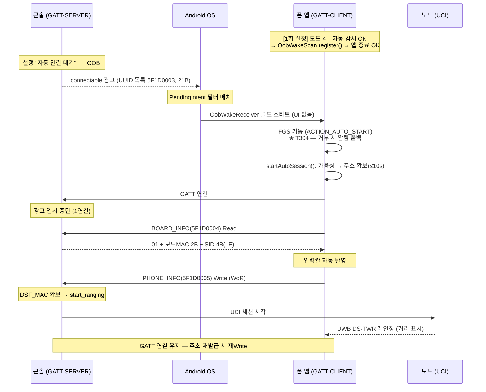

# 콜드 웨이크 동작 시나리오 — 폰·콘솔 구분 상세 (spec 002)

> 작성 2026-08-15. 모드 4(GATT 역방향) 기반 콜드 웨이크의 단계별 동작을 **폰과 콘솔을
> 정확히 구분**해 정리한 문서 — T304 스파이크·합동 검수 15~18 의 절차·판정 기준을 겸한다.
> 계약 원문: `docs/oob/BLE_OOB_인터페이스_사양서.md` v0.5 (§3-1·§5-4·§6·§7-16~18·§10).
> 함수 수준 추적: 같은 폴더 `검수10-13_함수_호출_맵.md` 와 이 문서의 함수명 참조.

## 0. 등장인물

| | 역할 (BLE) | UWB 역할 (불변 — P15) | 핵심 클래스 |
|---|---|---|---|
| **콘솔** (보드 USB 연결, 고정 설치) | **GATT-SERVER** — connectable 광고 송출 + GATT 서버. 설정 라벨 **"자동 연결 대기"** | controller (보드) 쪽 | `GattServerBleOobChannel` (콘솔 리포 spec 009) |
| **폰** (controlee, 접근하는 쪽) | **GATT-CLIENT** — 평소엔 잠들어 있다가 광고에 깨어나 스캔·연결. **송출 0건** (iOS 성립 조건, §10) | controlee | `OobWakeScan` · `OobWakeReceiver` · `RangingCoordinator` · `OobCentral` |

## 1. 전체 흐름 한눈에



## 2. 0단계 — 1회 설정 (폰, 앱 실행 상태에서)

| 순서 | 폰 조작 | 내부 동작 (소스) |
|---|---|---|
| 0-1 | 모드 드롭다운 = **"4 · GATT 연결 (iOS)"** | `OobMode.CENTRAL` 영속화 (`oob_mode`) |
| 0-2 | **"자동 감시" 스위치 ON** — 모드 4 일 때만 화면에 보임 | 권한(BLUETOOTH_SCAN·CONNECT + 알림) 없으면 요청 → 허용 후 **재탭** (`MainActivity.toggleAutoWatch`) |
| 0-3 | 로그 `자동 감시 ON — 콘솔 발견 시 백그라운드에서 자동 시작` | `RangingCoordinator.toggleAutoWatch()` → `OobWakeScan.register()` — **OS 에 PendingIntent 스캔 등록** (UUID `5F1D0003` HW 필터, LOW_POWER, FLAG_MUTABLE) |
| 0-4 | **앱을 완전히 닫아도 됨** (태스크 스와이프 제거 포함) | 등록은 OS 가 프로세스 밖에서 유지 |

이 시점의 폰 상태: **앱 프로세스 없음 · 화면 꺼짐 · BLE 송출 0건.** OS 만 필터를 들고 있다.

⚠ 주의:
- **재부팅하면 OS 등록이 소멸** — 토글을 다시 켜야 한다 (BOOT_COMPLETED 재등록은 범위 밖)
- 모드를 4 에서 다른 모드로 바꾸면 **자동 감시가 자동 OFF** 된다 (`onOobModeChanged`)
- Galaxy "잠자는 앱" 이 등록을 죽일 수 있다 — **배터리 최적화 제외 권장**

## 3. 1단계 — 콘솔이 부른다

| 순서 | 콘솔 | 폰 |
|---|---|---|
| 1-1 | 설정 ⚙ → OOB 교환 방식 = **"자동 연결 대기"** → **[OOB]** | — (잠들어 있음) |
| 1-2 | `connectable=true` 광고 시작 — Flags 3B + **Complete 128-bit UUID 목록**(`5F1D0003`) 18B = 21B. **Service Data·payload 없음** (§5-4). 타임라인 `BLE_ADV` | — |
| 1-3 | 광고 반복 (~250ms) | **OS 가 필터 매치** → 앱 프로세스 **콜드 스타트** → `OobWakeReceiver.onReceive()` (Activity·UI 없음) |

## 4. 2단계 — 폰이 깨어난다 (전부 백그라운드 — 화면 안 켜짐)

폰 내부 체인 (`adb logcat -s OobWakeReceiver` + 이후 앱 로그 콘솔):

```
OobWakeReceiver.onReceive
 ├ 스캔 오류 extras 확인 (EXTRA_ERROR_CODE) → 이상 없으면
 ├ 스로틀: 10초 내 중복 웨이크 무시 (광고는 계속 매치되므로 브로드캐스트가 반복됨)
 └ RangingForegroundService.startAutoWake()   ← ★ T304 스파이크 지점
    ├ [성공] onStartCommand(ACTION_AUTO_START)
    │   ├ startForeground() — 알림 "UWB 세션 동작 중" ← 성공의 가시 신호
    │   └ RangingCoordinator.startAutoSession()
    │      ├ 세션 이미 활성이면 무시 (중복 웨이크 이중 방어)
    │      ├ checkAvailability → READY 판정
    │      ├ controlee 스코프 발급 → 내 주소 확보 (최대 10초 — 실패 시 로그 + FGS 종료)
    │      └ startRanging() — 모드 4 분기 진입 (아래 3단계)
    └ [거부 — 백그라운드 FGS 시작 제한] catch (ForegroundServiceStartNotAllowedException 등)
        └ 고우선 알림 "UWB 콘솔 발견 — 탭하여 레인징을 시작하세요" (T303 폴백)
           탭 → MainActivity → 사용자가 Start (포그라운드 경로)
```

## 5. 3단계 — GATT 교환 (폰 = client ↔ 콘솔 = server)

| 순서 | 폰 (`OobCentral`) | 콘솔 (`GattServerBleOobChannel`) |
|---|---|---|
| 3-1 | UUID 필터 스캔 — 로그 `GATT-CLIENT 스캔 시작`, 배지 ⚪ 스캔중 | 광고 계속 |
| 3-2 | 발견 → `connectGatt()` — `콘솔 발견 … GATT 연결 시도` | 연결 수신 → **광고 일시 중단** (1연결 가정, §9-5). 타임라인 `BLE_CONN` |
| 3-3 | `콘솔 GATT 연결됨 — 서비스 탐색` → **BOARD_INFO(`5F1D0004`) Read**. 배지 🔵 콘솔 연결됨 | Read 응답: `01` + 보드 MAC 2B + SID 4B (**LE** — 42 = `2A 00 00 00`) |
| 3-4 | `BOARD_INFO 수신 — 보드 XX:XX · session N 자동 반영` — 입력칸 자동 채움 | — |
| 3-5 | **PHONE_INFO(`5F1D0005`) Write** — **Write Without Response** (응답 안 기다림, §3-1). SID 가 Start 시점과 다르면 새 SID 로 **재Write** | Write 수신 → **폰 주소(DST_MAC) 자동 반영**. `OOB_DONE`. ⚠ 연결 후 **30초**(`WRITE_TIMEOUT`) 내에 와야 함 — 초과 시 수동 입력 안내 (§7-16) |
| 3-6 | `UWB 세션 시작 — BOARD_INFO 수신 (GATT 교환 완료)` — controlee 대기(WAITING) | **자동 `start_ranging`** → 보드 UCI 세션 시작 |
| 3-7 | **거리 표시** (RANGING) — 여기까지 사용자 조작 0회 | 레이더 거리 표시, `RANGING` |

**GATT 연결은 레인징 중에도 유지된다** — 주소 재발급의 전달 채널이다 (아래 6-B).

## 6. 4단계 — 이후 생길 수 있는 일 (분기별)

| # | 상황 | 폰 | 콘솔 |
|---|---|---|---|
| A | 세션 자동 실패 (측정 0건 ~10초 등) | `ERROR` 전환 — **연결·FGS 유지** (keepOob, P7) → 주소 재발급 | — |
| B | 주소 재발급 | `pushOobPayloadUpdate` → `OobCentral.updatePayload` → **PHONE_INFO 재Write** (모드 1 Notify 대응물) | 값 변경 감지 → 새 DST_MAC 반영 (OOB_DONE 재발행 없음) |
| C | GATT 끊김 | `연결 끊김 — 스캔 재개` → 재발견·재연결 (재시도 = 끊고 재스캔이 안전 경로) | **광고 재개** (§7-17). 레인징 중이면 UWB 무영향 (BLE≠UWB) |
| D | 30초 내 교환 미완 | `콘솔 GATT 교환 미완료 — 수동 입력값으로 UWB 시작` (§7-16 폴백) | 30초 후 수동 입력 안내 |
| E | 짝 불일치 (콘솔이 다른 모드) | 모드 4 광고가 없어 스캔 0건 → 30초 폴백. 모드 3 광고에는 **반응하지 않음** (UUID 목록 없음 — §5-4 교차 매치 차단) | — |
| F | 사용자 Stop | 연결·FGS 종료. **자동 감시 등록은 유지** — 다음 콘솔 광고에 다시 깨어남 | 끊김 감지 → 광고 재개 |
| G | PHONE_INFO 검증 실패 | 알 수 없음 (WoR — 응답 없음) | ERR + raw hex **콘솔 로그만** (§7-18), 기존 유효 값 유지 |

## 7. 타이머 총정리 (디버깅 치트시트)

| 타이머 | 값 | 위치 | 의미 |
|---|---|---|---|
| 웨이크 스로틀 | 10초 | 폰 `OobWakeReceiver` | 반복 브로드캐스트의 FGS 재기동 시도 방지 |
| 준비 대기 | 10초 | 폰 `startAutoSession` (`AUTO_WAKE_READY_TIMEOUT_MS`) | 콜드 스타트 시 UWB 주소 확보 상한 — 초과 시 FGS 종료 |
| 교환 폴백 | 30초 | 폰 `waitForBoardInfo` (`SCAN_WAIT_TIMEOUT_MS`) | 연결/Read 미완 시 수동 입력값으로 UWB 시작 (§7-16) |
| Write 창 | 30초 | 콘솔 `WRITE_TIMEOUT_MS` | 연결 후 이 안에 PHONE_INFO 가 와야 함 — FGS 기동 시간 감안해 넉넉히 |
| 프레임워크 자동 종료 | ~10초 | Android UWB 스택 | 유효 측정 0건이면 세션 자동 종료 — 재Write/재시작으로 복구 |

## 8. T304 스파이크 판정 기준 (최우선 실기기 확인)

**절차**: 폰 = 모드 4 + 자동 감시 ON → **앱 태스크 제거 + 화면 OFF** → 콘솔 "자동 연결 대기" 시작.

| 관찰 | 판정 |
|---|---|
| "UWB 세션 동작 중" **FGS 알림이 저절로 뜨고** 자동 레인징까지 진행 | ✅ **콜드 웨이크 성립** — 백그라운드 FGS 예외 적용됨 |
| FGS 알림 대신 **"UWB 콘솔 발견" 고우선 알림만** 뜸 | ⚠ 백그라운드 FGS **거부** — 폴백은 정상 동작. 설계는 **대기(Arm) 방식으로 후퇴** (기존 합의) |
| 아무것도 안 뜸 | ❌ OS 웨이크 미도달 — ① 배터리 최적화(잠자는 앱) ② 토글 상태(재부팅 후?) ③ `adb logcat -s OobWakeReceiver` 로 리시버 도달 여부 확인 |

## 9. iOS 폰이라면 (후속 리포 — 참고)

같은 계약 위에서 경로만 다르다: PendingIntent 스캔 대신 **pending connect / State Restoration**
(가이드 `ble_dev_guide.md` §5-2·§7-3). 콘솔 광고에 UUID 목록이 있으므로 iOS 백그라운드 필터가
매치되고, 폰은 송출이 0건이라 CoreBluetooth 제약에 걸리지 않는다 (§10).
차이: 사용자 강제 종료 시 영구 미복원 · 재부팅 후 1회 실행 필요 · 발견 지연 큼.
백그라운드 UWB(Nearby Interaction) 정책은 iOS 실기기 스파이크가 필요하다 (P9).
